

  
  <h1 style="margin-top: 15px; margin-bottom: 5px;">GeOP Maps</h1>
  
<strong>Aplicativo de Gerenciamento de Operações com Rastreamento em Tempo Real</strong>

GeOP é uma aplicação desenvolvida para auxiliar planejamento, gerenciamento e execução de operações policiais, oferecendo recursos de compartilhamento de localização em tempo real, gestão de integrantes, equipes, recursos, registros e alertas. 

---

## 🗺️ Localização e Mapeamento

- **Rastreamento de localização em tempo real** com modos em primeiro e segundo plano
- **Compartilhamento de posição ao vivo** entre membros da operação
- **Mapas offline** com suporte ao formato GeopDB
- **Múltiplas opções de mapas base** para diferentes terrenos e cenários
- **Integração com navegação** compatível com 20+ apps (Google Maps, Waze, Apple Maps, HERE, Sygic e mais)
- **Bússola e indicador de direção** para orientação
- **Sessões de rastreamento** com gravação de local, distância e métricas de velocidade
- **Visualização de curvas de nível** em arquivos GeopDB
- **Roteamento fluvial** utilizando dados do OpenStreetMaps
- **Importação de arquivos PDF/KML/GPX** para dados geográficos externos

  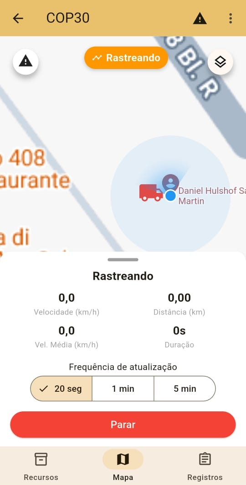
  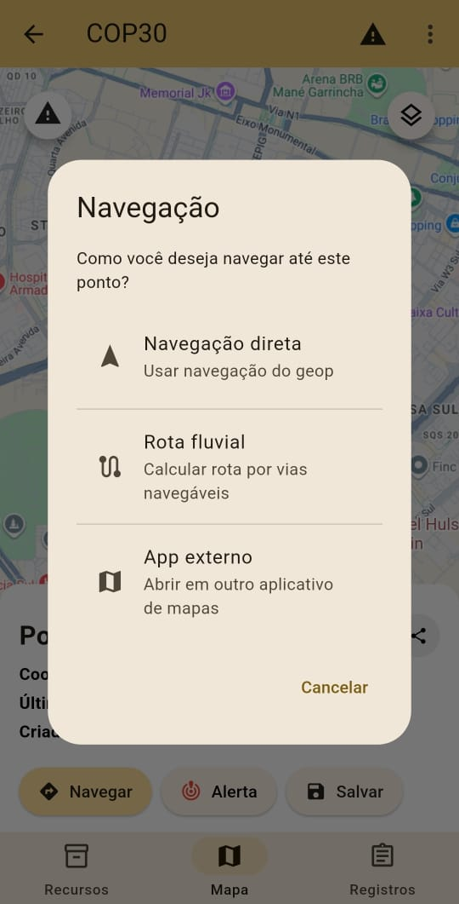
  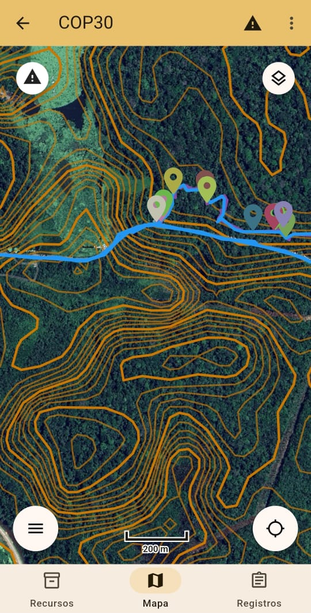

---

## 👥 Gestão de Operações e Equipes

- **Criar e gerenciar operações** com tipos de atividade personalizáveis
- **Organização de equipes** com estrutura hierárquica (líderes e membros)
- **Definição de funções** dos membros das equipes 
- **Gestão de integrantes** com permissões baseadas em funções
- **Sistema de convites** para adicionar novos integrantes às operações
- **Acompanhamento de status** da operação (planejamento, ativa, concluída)
- **Agendamento de datas** de início e término das operações

  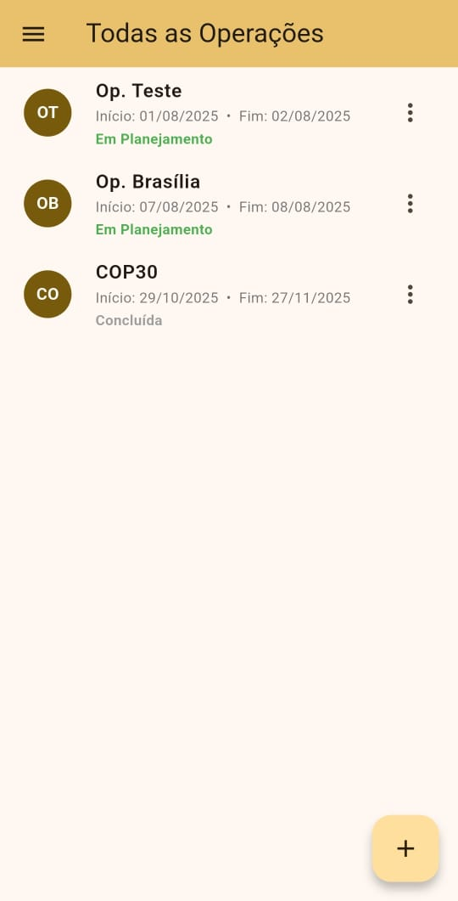
  
  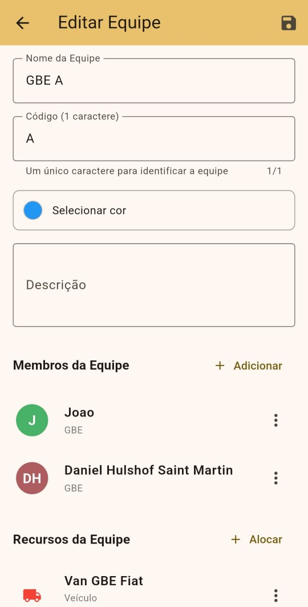

---

## 🔐 Permissões e Segurança

- **Sistema granular de permissões** incluindo:
  - Visualizar/Editar Integrantes
  - Visualizar/Editar Equipes
  - Visualizar/Editar Registros
  - Visualizar/Editar Recursos
  - Visualizar/Editar Feições
  - Editar configurações da Operação
- **Autenticação segura** via Firebase Authentication
- **Configurações de privacidade** com controles de visibilidade baseados em contatos
- **Armazenamento local criptografado**

  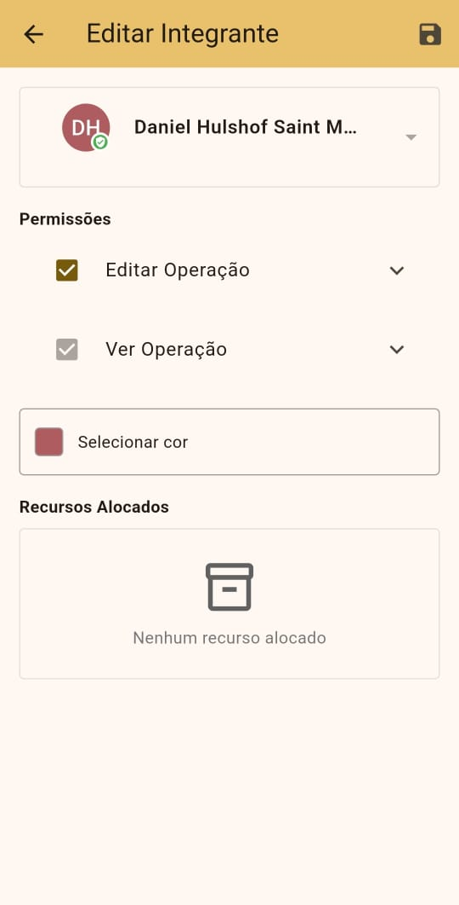
  
  

---

## 📋 Registros e Gestão de Dados

- **Modelos de registro personalizáveis** para entrada estruturada de dados
- **Gestão de recursos** com modelos de recursos e alocação a integrantes e equipes
- **Captura de fotos como evidência** com integração à câmera
- **Exportação de dados** em múltiplos formatos para análise por IA
- **Vínculos** para conectar registros e entidades relacionadas

  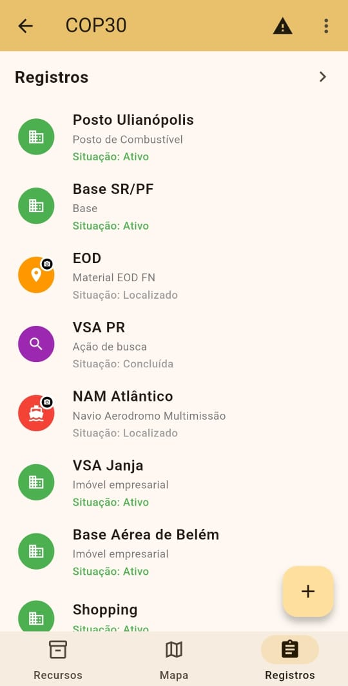
  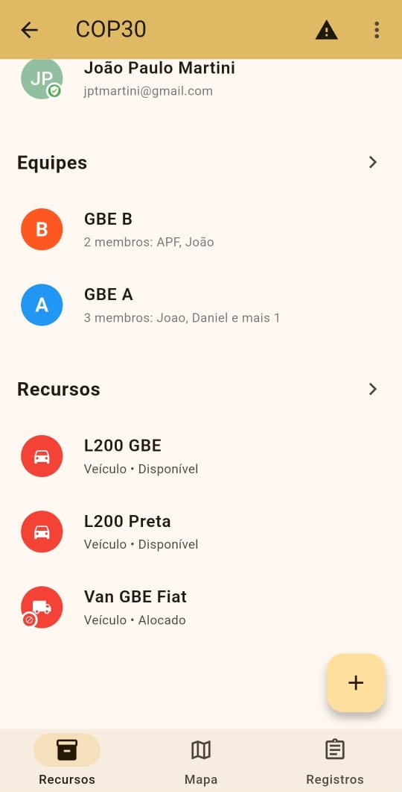
  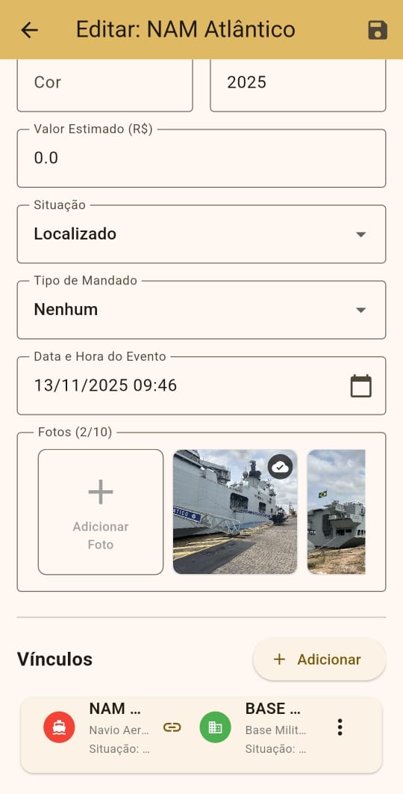

---

## 🗂️ Feições e Camadas do Mapa

- **Camadas vetoriais** para organização de elementos do mapa
- **Feições de camada** (pontos, linhas, polígonos) com estilização personalizada
- **Alvos e pontos de referência** no mapa
- **Gerenciamento de visibilidade** de elementos por usuário
- **Ordenação e agrupamento** de elementos
- **Detalhes das feições** com descrições e metadados

  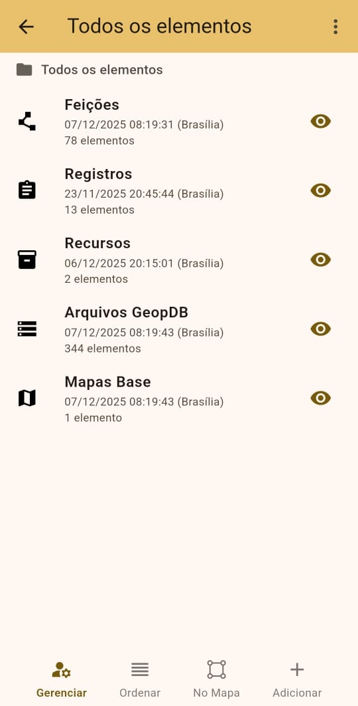
  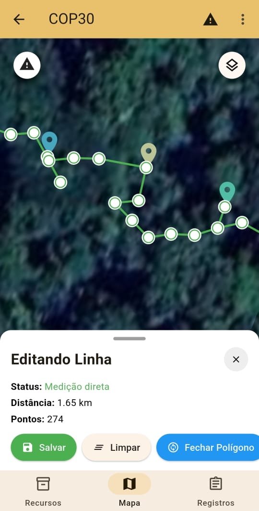
  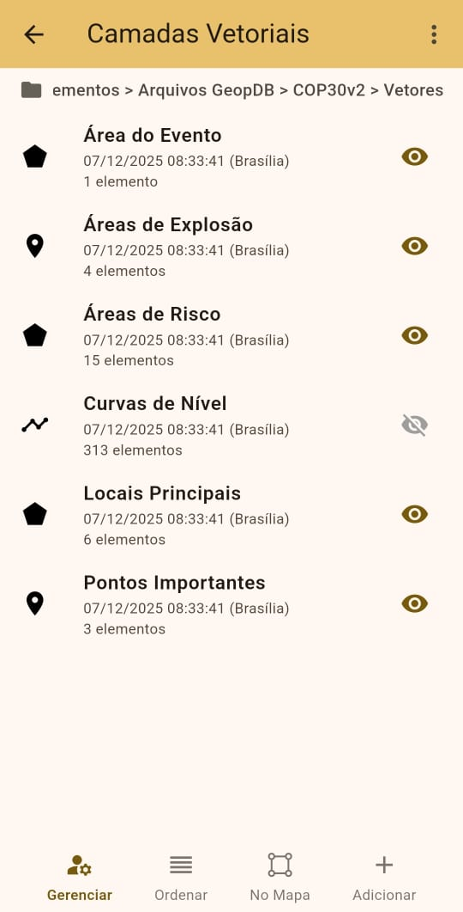

---

## 🔔 Alertas e Notificações

- **Notificações** via push notifications
- **Alertas de emergência** para situações críticas
- **Notificações de atualizações** da operação
- **Sistema de gerenciamento** de alertas

  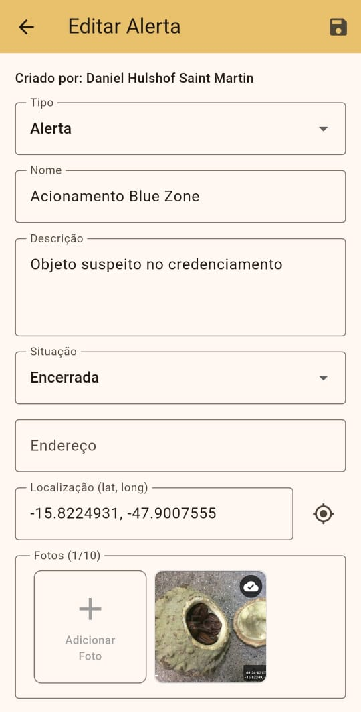
  
  

---

## ☁️ Nuvem e Sincronização

- **Sincronização com a nuvem** via Google Firebase
- **Atualizações de dados em tempo real** entre dispositivos
- **Arquitetura offline-first** com cache local
- **Timestamps baseados em NTP** para sincronização precisa de horário
- **Sincronização de fotos** para armazenamento em nuvem

  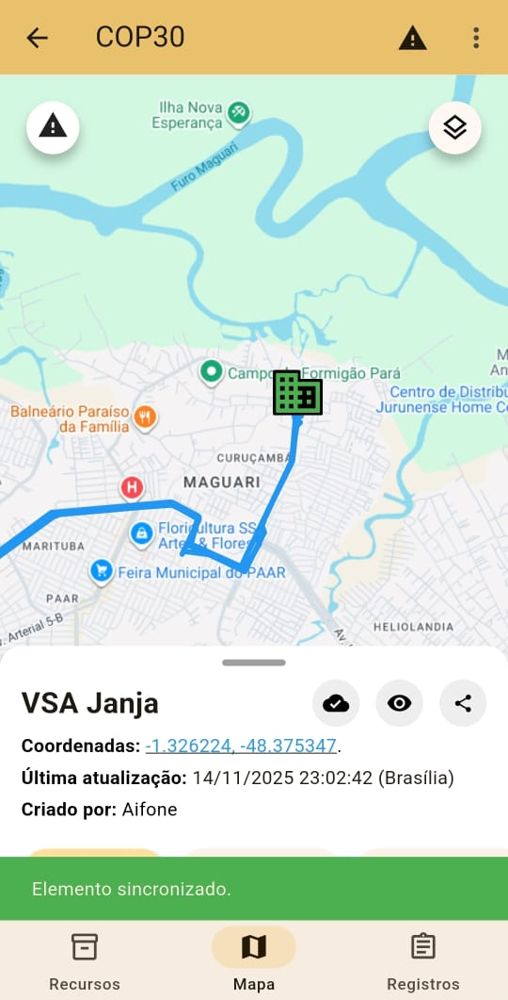
  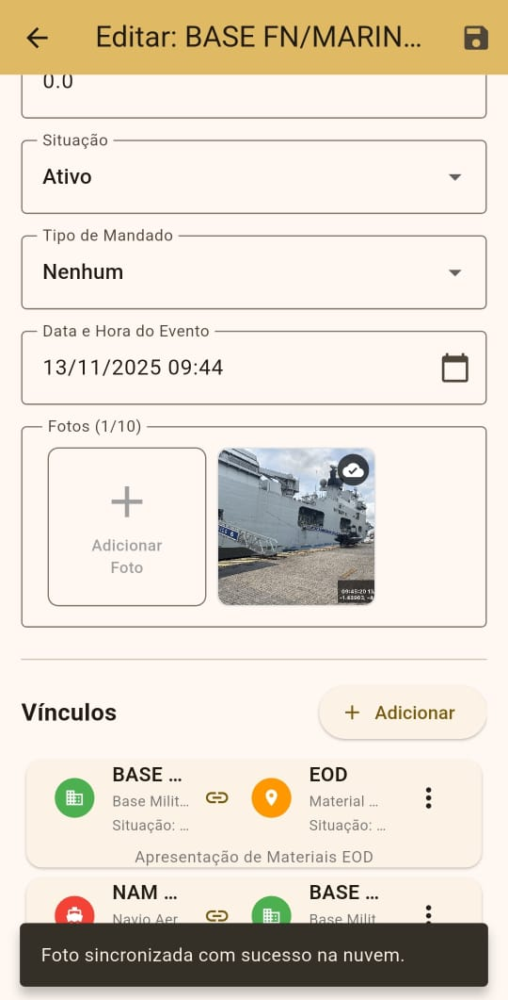

---

## 📱 Planos de Assinatura

| Plano | Recursos |
|-------|----------|
| **Offline** | Modo local apenas, sem sincronização com a nuvem |
| **Online** | Sincronização com a nuvem, intervalos de comunicação de 5 minutos |
| **Realtime** | Todos os recursos, comunicação em tempo real |

  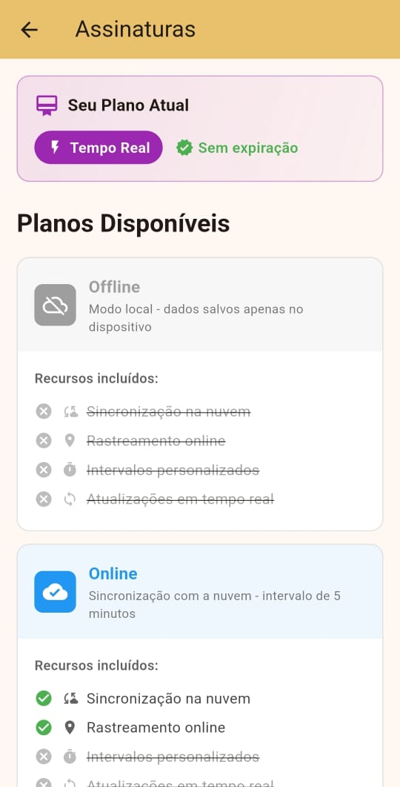
  

---

## 🌐 Suporte Multiplataforma

  

    🤖
    <h3>Android</h3>
    
Suporte completo com serviços de localização em segundo plano

  

  

    🍎
    <h3>iOS</h3>
    
Suporte completo com rastreamento nativo de localização

  

---

## 📤 Importação e Exportação

| Formato | Descrição |
|---------|-----------|
| **GeopDB** | Formato personalizado para mapas offline |
| **GeoPDF** | Formato de mapas georeferenciados |
| **KML** | Formato Google Earth |
| **GPX** | Formato de intercâmbio GPS |
| **JSON** | Exportação de dados da operação |

  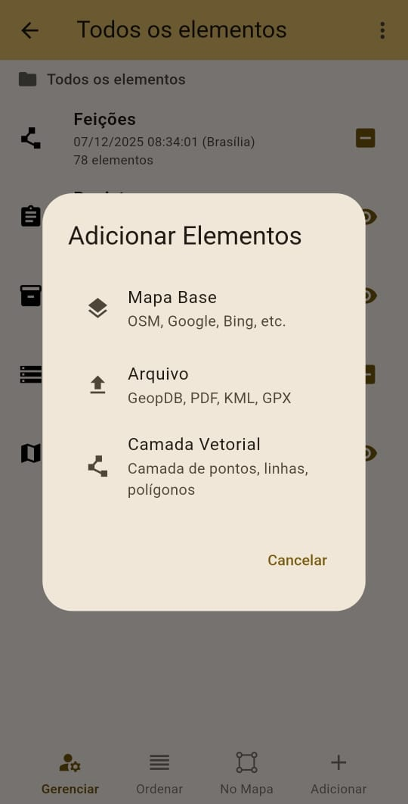
  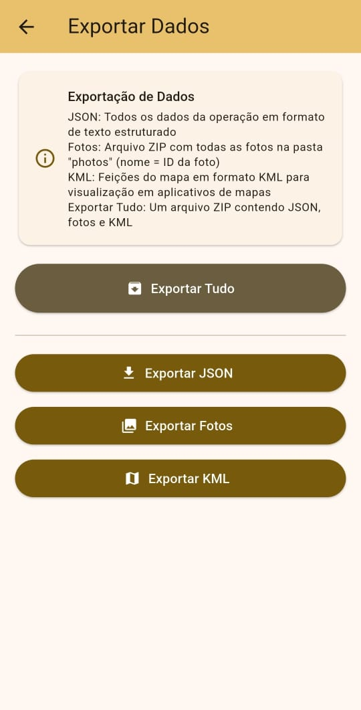

---

## 📲 Baixe Agora

  

---

## 📧 Contato

Para dúvidas, sugestões ou suporte, entre em contato conosco.
danielhsmartin@gmail.com
---

  
  
© 2025 GeOP - Todos os direitos reservados

